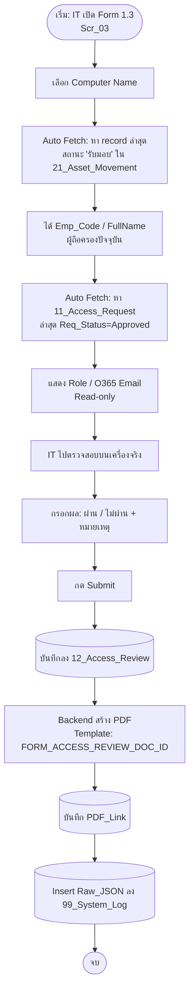
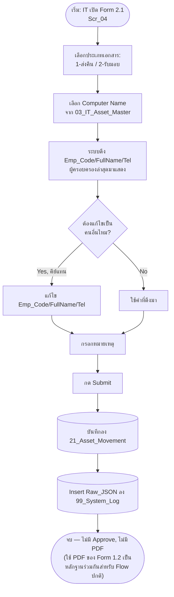
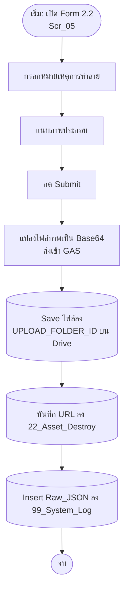
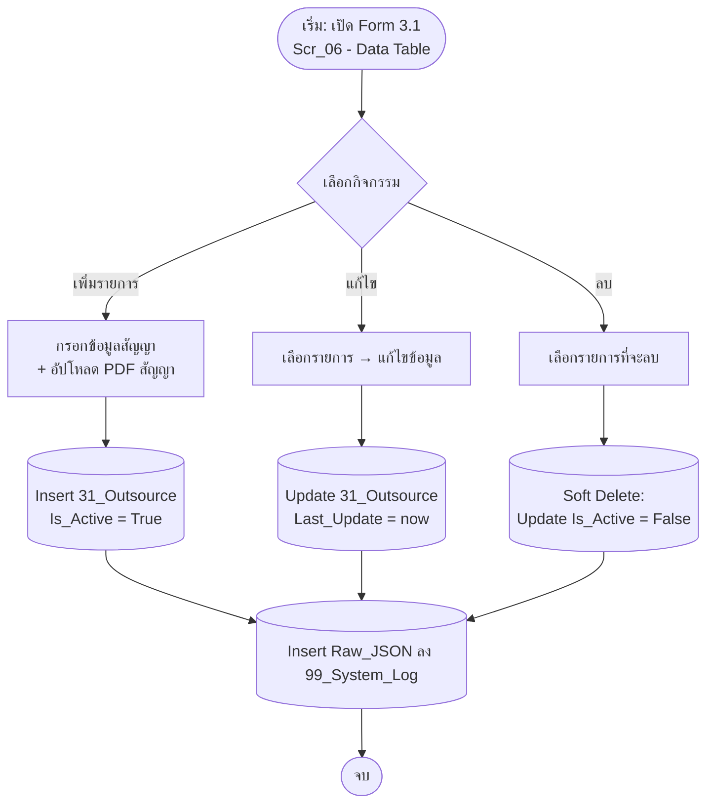
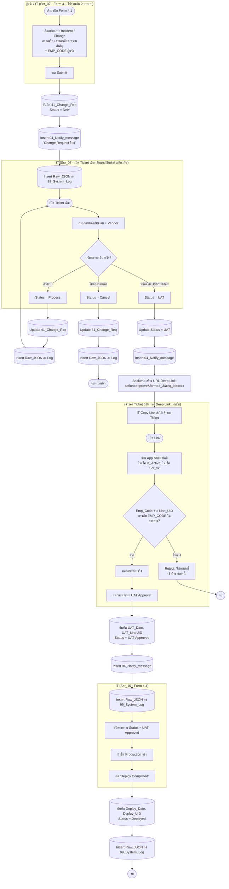
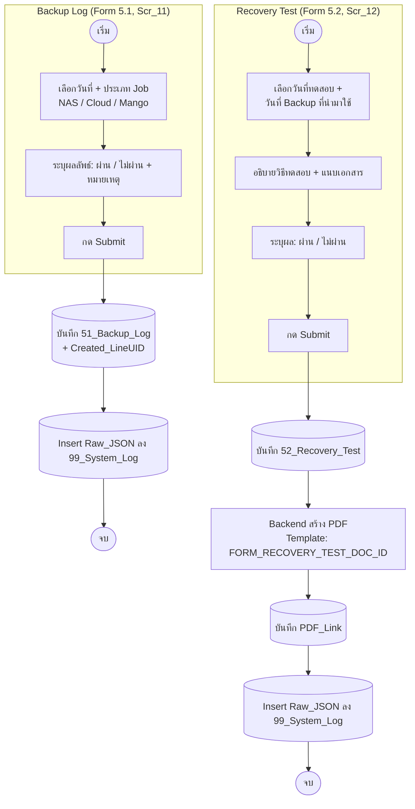
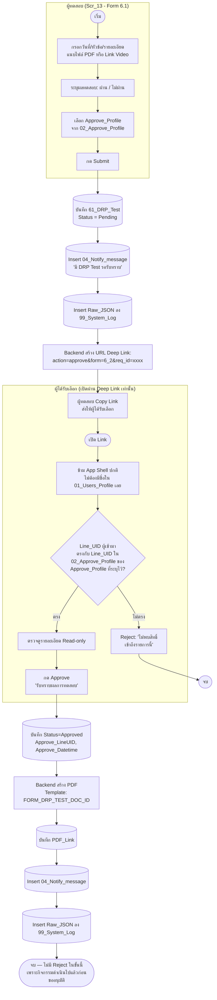
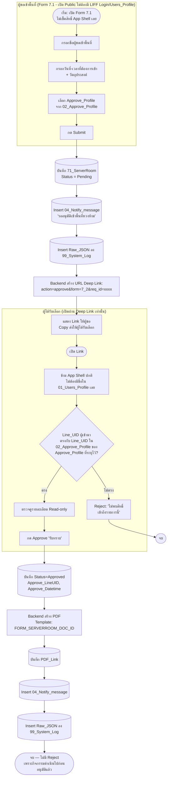
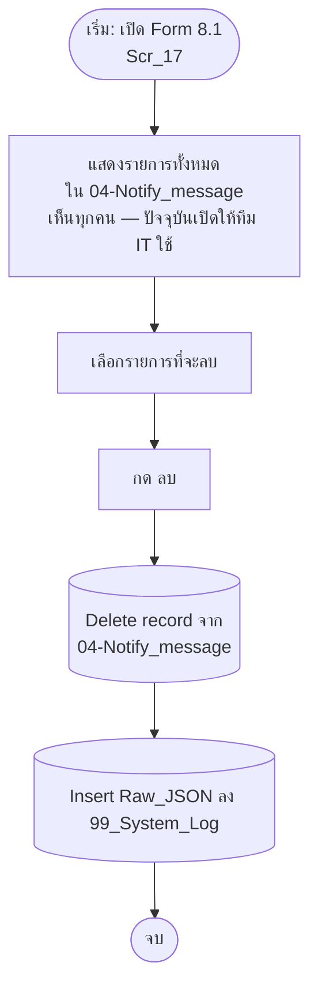

# Process Flowcharts — IT Management & COSO-ITGC Compliance System (v4)
สำหรับแนบท้ายเอกสาร Spec เพื่อใช้ประกอบการทำ Work Instruction (WI) และการตรวจสอบของ Audit
(Copy โค้ดแต่ละบล็อกไปวางใน draw.io ได้ทีละ Flow — อัปเดตตาม Spec v4: Deep Link Approve, ตัด LINE Push, ตัด PDF ของ Asset Movement)

---

## 1. Data Access Control — UAR (Form 1.1 → Deep Link → Form 1.2)

```mermaid
flowchart TD
    subgraph IT1["เจ้าหน้าที่ IT (Scr_01 - เข้าเมนูหลัก)"]
        A1([เริ่ม: เปิด Form 1.1]) --> A2[กรอกประเภทรายการ:<br/>ผู้ใช้ใหม่ / ลาออก / แก้ไขสิทธิ์]
        A2 --> A3{ประเภท = แก้ไขสิทธิ์?}
        A3 -->|Yes| A4[ดึง Role/365/Computer/VPN<br/>ล่าสุดของผู้ใช้นี้มาแสดง]
        A3 -->|No| A5[กรอกวันที่-เวลาส่งมอบ]
        A4 --> A6[เลือก Role ที่ต้องการ]
        A5 --> A6
        A6 --> A7[กด Submit]
    end

    A7 --> S1[(บันทึกลง 11_Access_Request<br/>Req_Status = Pending)]
    S1 --> S2[(Insert 04_Notify_message<br/>'มี UAR รอผู้ใช้ยอมรับ')]
    S2 --> S3[(Insert Raw_JSON ลง 99_System_Log)]
    S3 --> S4[Backend สร้าง URL Deep Link:<br/>action=approve&form=1_2&req_id=xxxx]
    S4 --> S5[IT Copy Link ส่งให้เจ้าของสิทธิ์<br/>ทาง LINE/Email]

    subgraph U["เจ้าของสิทธิ์ (เปิดผ่าน Deep Link เท่านั้น)"]
        S5 --> B1([เปิด Link บนมือถือ])
        B1 --> B2["ข้าม App Shell ปกติทั้งหมด<br/>ไม่เช็ค Is_Active, ไม่เช็ค Scr_xx"]
        B2 --> B3{Emp_Code จาก Line_UID<br/>ตรงกับ Emp_Code ในรายการ?}
        B3 -->|ไม่ตรง| B4[Reject: 'ไม่พบสิทธิ์<br/>เข้าถึงรายการนี้']
        B3 -->|ตรง| B5{Status ของรายการ<br/>ยังเป็น Pending?}
        B5 -->|No| B6[แสดง Read-only:<br/>'รายการนี้ถูกดำเนินการแล้ว']
        B5 -->|Yes| B7[แสดงข้อมูลจาก Form 1.1<br/>Read-only ทั้งหมด]
        B7 --> B8{ติ๊กยอมรับเงื่อนไข?}
        B8 -->|No| B7
        B8 -->|Yes| B9{กด Approve<br/>หรือ Reject?}
    end

    B4 --> END1([จบ])
    B6 --> END2([จบ])

    B9 -->|Reject| C1[(ปรับ Req_Status = Rejected)]
    C1 --> C2[(Insert Raw_JSON ลง 99_System_Log)]
    C2 --> END3([จบ])

    B9 -->|Approve| D1[(บันทึก Approve_LineUID)]
    D1 --> D2[Backend สร้าง PDF<br/>Template: FORM_UAR_APPROVE_DOC_ID]
    D2 --> D3[(บันทึก PDF_Link)]
    D3 --> D4{Req_Type เดิม<br/>คืออะไร?}
    D4 -->|ผู้ใช้ใหม่| D5[(สร้าง 21_Asset_Movement<br/>Doc_Type = 2-รับมอบ)]
    D4 -->|ลาออก| D6[(สร้าง 21_Asset_Movement<br/>Doc_Type = 1-ส่งคืน)]
    D4 -->|แก้ไขสิทธิ์| D7[ไม่ต้องสร้าง<br/>21_Asset_Movement]
    D5 --> D8[(Insert 04_Notify_message)]
    D6 --> D8
    D7 --> D8
    D8 --> D9[(Insert Raw_JSON ลง 99_System_Log)]
    D9 --> END4([จบ — มี PDF เป็นหลักฐานครบ])
```

---

## 2. Access Review — ทบทวนสิทธิ์ประจำปี (Form 1.3)

---

## 3. IT-Asset — Asset Movement (Form 2.1)

---

## 4. IT-Asset — Asset Destroy (Form 2.2)

---

## 5. Outsourcing Control — Contract Management (Form 3.1, CRUD)

---

## 6. Change Management & Helpdesk (Form 4.1 → Deep Link → Form 4.3 → Form 4.4)

---

## 7. Backup & Recovery (Form 5.1, 5.2)

---

## 8. BCP & DRP — DRP Test (Form 6.1 → Deep Link → Form 6.2)

---

## 9. Physical Security — Server Room Access (Form 7.1 → Deep Link → Form 7.2)

---

## 10. Notify Message Board (Form 8.1)

---

### หมายเหตุสำหรับ Auditor / WI

- ทุก Flow ที่มีขั้นตอน "Insert Raw_JSON ลง 99_System_Log" คือจุดที่ระบบบันทึก Audit Trail ตามมาตรฐาน COSO-ITGC — เกิดขึ้นทุกครั้งที่มี Request เข้า Backend โดยไม่มีข้อยกเว้น ทั้งเส้นทางเมนูหลักและ Deep Link
- กล่องทรงกระบอก (Cylinder) หมายถึงจุดที่มีการเขียน/อ่านข้อมูลใน Google Sheets
- **จุด "ข้าม App Shell ปกติ"** ปรากฏใน Flow 1, 6, 8, 9 — คือหน้าจอ Approve ที่เข้าผ่าน Deep Link เฉพาะรายการเท่านั้น (Form 1.2, 4.3, 6.2, 7.2) **ไม่เช็ค Is_Active และไม่เช็ค Scr_xx ใด ๆ** ตรวจสอบตัวตนด้วยเงื่อนไขเฉพาะฟอร์มแทน (Emp_Code match สำหรับ 1.2/4.3, Line_UID match กับ 02_Approve_Profile สำหรับ 6.2/7.2) — ออกแบบเพื่อให้พนักงานที่เพิ่งถูกปรับ Is_Active=No (เช่น กรณีลาออก) ยังกดยืนยันรายการของตัวเองได้
- Flow 6.2 และ 7.2 (DRP Test, Server Room) ไม่มี Path "Reject" ตามการตัดสินใจทางธุรกิจ (กิจกรรมดำเนินไปแล้วก่อนขออนุมัติ ปุ่ม Approve มีความหมายเป็น "รับทราบ" เท่านั้น)
- Flow 3 (Asset Movement, Form 2.1) ไม่มีการสร้าง PDF อีกต่อไป — ยืนยันแล้วว่า PDF จาก Form 1.2 เพียงพอเป็นหลักฐานสำหรับ Flow ปกติ (ผู้ใช้ใหม่/ลาออก) ส่วน Form 2.1 ใช้บันทึกกรณีอื่นนอกเหนือ Flow หลักเท่านั้น
- ตัดขั้นตอน LINE Push แจ้งเตือนผู้ขอออกทั้งระบบ เนื่องจากผู้ใช้ทั่วไปแทบไม่ได้เข้าแอปเอง และทีม IT ประสานผลกับผู้ขอผ่าน Email/LINE (ส่ง Deep Link ตรง) ตามกระบวนการทำงานจริงอยู่แล้ว — คงเหลือเฉพาะการแจ้งเตือนภายในแอป (04-Notify_message) สำหรับฝั่ง IT/ผู้อนุมัติเท่านั้น
